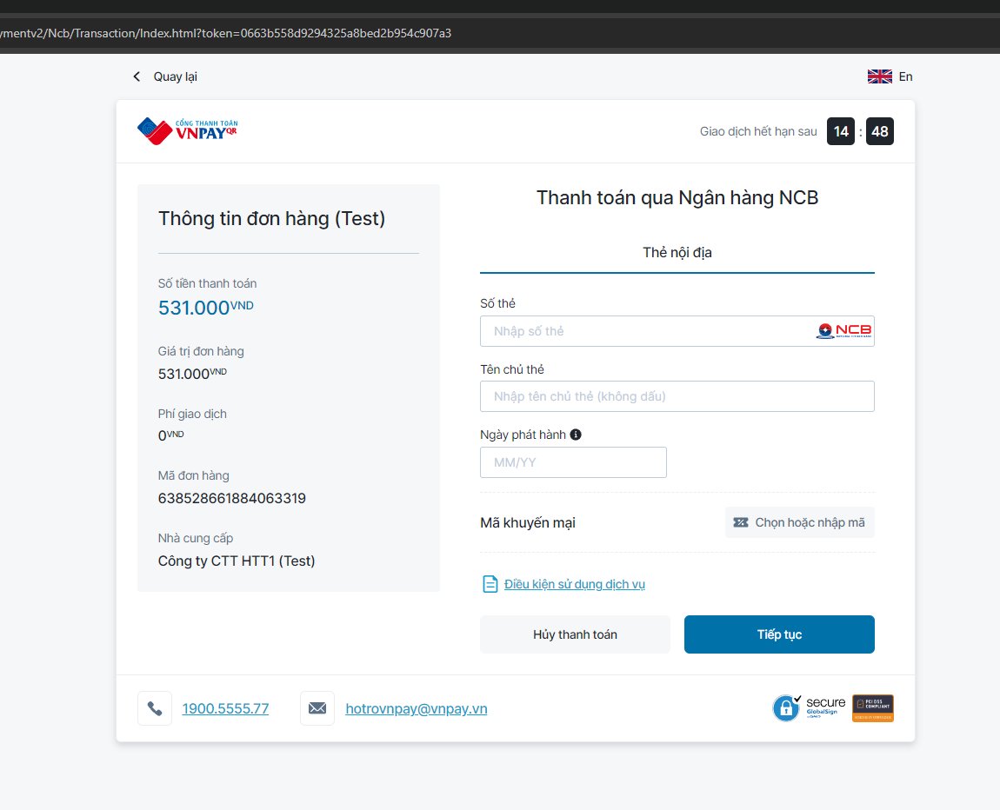
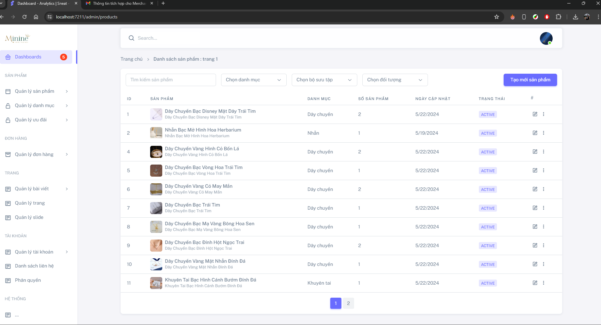
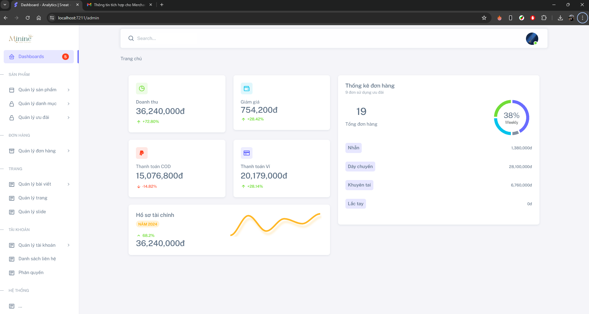

# Minine_Accessories_DACS_K21
# 💍 Minine Accessories - Website Bán Trang Sức Online

> 📌 Đồ án Cơ Sở Ngành Công Nghệ Phần Mềm - HUTECH  
> 📅 Hoàn thành tháng 5 năm 2024  
> 🎓 Sinh viên thực hiện: Ka + nhóm bạn ngành CNTT  
> 🧠 Giảng viên hướng dẫn: ThS. Bùi Danh Hường  

---

## 🔮 Giới thiệu Dự Án

**Minine Accessories** là một nền tảng thương mại điện tử được xây dựng với mục tiêu giúp các cửa hàng trang sức có thể kinh doanh online dễ dàng hơn, đồng thời nâng cao trải nghiệm mua sắm trực tuyến cho người dùng.

Trang web cho phép:
- Khách hàng duyệt, chọn và mua trang sức online  
- Quản trị viên quản lý sản phẩm, đơn hàng, tài khoản, bài viết và khuyến mãi  
- Thanh toán trực tuyến qua **VNPAY** hoặc **COD**

👉 Đây không chỉ là một trang web bán hàng, mà là một hệ sinh thái thương mại điện tử nhỏ gọn, thân thiện, trực quan và dễ mở rộng.

---

## 🧪 Tính năng chính

### 🎯 Cho khách hàng:
- Đăng ký / đăng nhập (kể cả qua Google)
- Xem sản phẩm, tìm kiếm, lọc, sắp xếp
- Thêm sản phẩm vào giỏ, đặt hàng, thanh toán
- Theo dõi lịch sử đơn hàng
- Liên hệ và xem tin tức thời trang

### 🛠️ Cho quản trị viên:
- Quản lý sản phẩm, danh mục, khuyến mãi
- Thống kê doanh thu theo tháng
- Quản lý người dùng và phân quyền
- Duyệt và xử lý đơn hàng
- Tạo bài viết, tin tức

---

## 🖼️ Hình ảnh minh họa

Dưới đây là một số giao diện chính của website **Minine Accessories**:

### 🧑‍💻 Giao diện trang chủ (index)

---

### 🛒 Giao diện trang sản phẩm

---

### 📥 Giao diện trang thanh toán

---

### 🗂️ Giao diện quản lý sản phẩm (Admin)

---

### 🧑‍💼 Giao diện quản trị viên

---

## 🔧 Công nghệ sử dụng

| Phần | Công nghệ |
|------|-----------|
| Frontend | HTML, CSS, JavaScript, Bootstrap, jQuery |
| Backend | ASP.NET Core (C#), Entity Framework Core |
| Cơ sở dữ liệu | SQL Server |
| Khác | VNPAY API, ToastNotification, OwlCarousel, ApexCharts |

---

## 🛠️ Kiến trúc & Thiết kế
- **Mô hình MVC**
- Giao diện responsive thân thiện với desktop & mobile
- Tích hợp đa dạng thư viện JS hỗ trợ trải nghiệm người dùng
- Đăng nhập bảo mật qua email hoặc Google OAuth2

---

## 🚀 Hướng phát triển tương lai
- Tối ưu bảo mật đơn hàng và thanh toán
- Tích hợp thêm AI tư vấn trang sức
- Thêm chức năng đánh giá sản phẩm bằng video hoặc ảnh
- Đồng bộ hóa đơn qua email / Zalo OA

---

## 🧠 Tự đánh giá

✅ Thành công:
- Giao diện đẹp, đầy đủ tính năng cơ bản
- Tối ưu trải nghiệm người dùng
- Quản lý hệ thống rõ ràng, thân thiện

❌ Chưa tốt:
- Còn lỗi nhỏ về nghiệp vụ đặt hàng
- Cơ sở dữ liệu chưa được thiết kế tối ưu

---

## 📎 Tài liệu tham khảo
- ASP.NET Core Docs  
- Bootstrap  
- VNPAY Docs  
- FontAwesome, Boxicons  
- Shopee Minine Accessories: [https://shopee.vn/minine.accessories](https://shopee.vn/minine.accessories)

---

> 📧 Mọi góp ý và phản hồi, vui lòng liên hệ: [Ka - Student IT tại HUTECH](https://facebook.com/ltiuKa)

